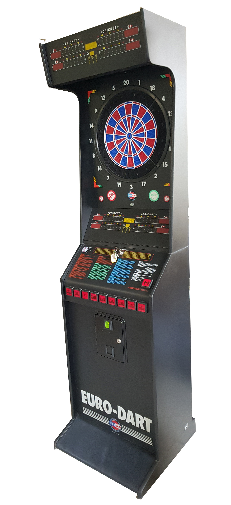

# Euro-Dart tournament-grade darts machine
## Electronic soft-tip darts machine 

#### My job was the electronic design (schematic and PCB), supervising of electronic manufacture (PCBs, cables, connections), software development, and product management (create serial numbers, pin codes, documentation).

<table><tr><td width="50%">
<h4>Hardware</h4>
<li>8052 microcontroller</li>
<li>EPROM, SRAM, EEPROM</li>
<li>Target-matrix, pushbuttons,</li>
<li>LEDs, 7-segment displays</li>
<li>Coin selector, ISD2560 speak IC</li>
<li>Piezo hit-sensor</li>
<li>Infra-human-sensor</li>
<h4>Software</h4>
<li>8051 Assembly</li>
<li>Non-volatile data storing</li>
<li>Self-test functions</li>
<li>Setup/settings functions</li>
<li>Statistics functions</li>
<li>Training mode</li>
<li>Tournament mode</li>
<li>Lot of game types</li>
</td>
<td></td></tr></table>

